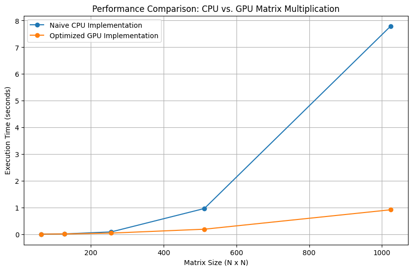

# MiniTorch Module 3


* Docs: https://minitorch.github.io/

* Overview: https://minitorch.github.io/module3.html


You will need to modify `tensor_functions.py` slightly in this assignment.

* Tests:

```
python run_tests.py
```

* Note:

Several of the tests for this assignment will only run if you are on a GPU machine and will not
run on github's test infrastructure. Please follow the instructions to setup up a colab machine
to run these tests.

This assignment requires the following files from the previous assignments. You can get these by running

```bash
python sync_previous_module.py previous-module-dir current-module-dir
```

The files that will be synced are:

minitorch/tensor_data.py minitorch/tensor_functions.py minitorch/tensor_ops.py minitorch/operators.py minitorch/scalar.py minitorch/scalar_functions.py minitorch/module.py minitorch/autodiff.py minitorch/module.py project/run_manual.py project/run_scalar.py project/run_tensor.py minitorch/operators.py minitorch/module.py minitorch/autodiff.py minitorch/tensor.py minitorch/datasets.py minitorch/testing.py minitorch/optim.py

# Diagnostics Script (3.1 and 3.2)

<details>
<summary>Please click to retrieve the diagnostics output from the diagnostic script</summary>
<pre>
        MAP

        ================================================================================
        Parallel Accelerator Optimizing:  Function tensor_map.<locals>._map,
        /Users/stephen/Desktop/Classes2024/MLE/mod3-stephendongg/minitorch/fast_ops.py
        (179)
        ================================================================================


        Parallel loop listing for  Function tensor_map.<locals>._map, /Users/stephen/Desktop/Classes2024/MLE/mod3-stephendongg/minitorch/fast_ops.py (179)
        --------------------------------------------------------------------------|loop #ID
        def _map(                                                             |
                out: Storage,                                                     |
                out_shape: Shape,                                                 |
                out_strides: Strides,                                             |
                in_storage: Storage,                                              |
                in_shape: Shape,                                                  |
                in_strides: Strides,                                              |
        ) -> None:                                                            |
                if np.array_equal(out_strides, in_strides) and np.array_equal(    |
                out_shape, in_shape                                           |
                ):                                                                |
                for out_ordinal_idx in prange(len(out)):----------------------| #2
                        out[out_ordinal_idx] = fn(in_storage[out_ordinal_idx])    |
                else:                                                             |
                for out_ordinal_idx in prange(len(out)):----------------------| #3
                        out_idx: Index = np.zeros(MAX_DIMS, dtype=np.int32)-------| #0
                        to_index(out_ordinal_idx, out_shape, out_idx)             |
                                                                                |
                        in_idx: Index = np.zeros(MAX_DIMS, dtype=np.int32)--------| #1
                        broadcast_index(out_idx, out_shape, in_shape, in_idx)     |
                                                                                |
                        out_value = index_to_position(out_idx, out_strides)       |
                        in_pos = index_to_position(in_idx, in_strides)            |
                                                                                |
                        out[out_value] = fn(in_storage[in_pos])                   |
        --------------------------------- Fusing loops ---------------------------------
        Attempting fusion of parallel loops (combines loops with similar properties)...
        Following the attempted fusion of parallel for-loops there are 3 parallel for-
        loop(s) (originating from loops labelled: #2, #3, #0).
        --------------------------------------------------------------------------------
        ---------------------------- Optimising loop nests -----------------------------
        Attempting loop nest rewrites (optimising for the largest parallel loops)...

        +--3 is a parallel loop
        +--0 --> rewritten as a serial loop
        +--1 --> rewritten as a serial loop
        --------------------------------------------------------------------------------
        ----------------------------- Before Optimisation ------------------------------
        Parallel region 0:
        +--3 (parallel)
        +--0 (parallel)
        +--1 (parallel)


        --------------------------------------------------------------------------------
        ------------------------------ After Optimisation ------------------------------
        Parallel region 0:
        +--3 (parallel)
        +--0 (serial)
        +--1 (serial)


        Parallel region 0 (loop #3) had 0 loop(s) fused and 2 loop(s) serialized as part
        of the larger parallel loop (#3).
        --------------------------------------------------------------------------------
        --------------------------------------------------------------------------------

        ---------------------------Loop invariant code motion---------------------------
        Allocation hoisting:
        The memory allocation derived from the instruction at
        /Users/stephen/Desktop/Classes2024/MLE/mod3-stephendongg/minitorch/fast_ops.py
        (194) is hoisted out of the parallel loop labelled #3 (it will be performed
        before the loop is executed and reused inside the loop):
        Allocation:: out_idx: Index = np.zeros(MAX_DIMS, dtype=np.int32)
        - numpy.empty() is used for the allocation.
        The memory allocation derived from the instruction at
        /Users/stephen/Desktop/Classes2024/MLE/mod3-stephendongg/minitorch/fast_ops.py
        (197) is hoisted out of the parallel loop labelled #3 (it will be performed
        before the loop is executed and reused inside the loop):
        Allocation:: in_idx: Index = np.zeros(MAX_DIMS, dtype=np.int32)
        - numpy.empty() is used for the allocation.
        None
        ZIP

        ================================================================================
        Parallel Accelerator Optimizing:  Function tensor_zip.<locals>._zip,
        /Users/stephen/Desktop/Classes2024/MLE/mod3-stephendongg/minitorch/fast_ops.py
        (231)
        ================================================================================


        Parallel loop listing for  Function tensor_zip.<locals>._zip, /Users/stephen/Desktop/Classes2024/MLE/mod3-stephendongg/minitorch/fast_ops.py (231)
        ---------------------------------------------------------------------------|loop #ID
        def _zip(                                                              |
                out: Storage,                                                      |
                out_shape: Shape,                                                  |
                out_strides: Strides,                                              |
                a_storage: Storage,                                                |
                a_shape: Shape,                                                    |
                a_strides: Strides,                                                |
                b_storage: Storage,                                                |
                b_shape: Shape,                                                    |
                b_strides: Strides,                                                |
        ) -> None:                                                             |
                if (                                                               |
                np.array_equal(out_strides, a_strides)                         |
                and np.array_equal(out_strides, b_strides)                     |
                and np.array_equal(out_shape, a_shape)                         |
                and np.array_equal(out_shape, b_shape)                         |
                ):                                                                 |
                for i in prange(len(out)):-------------------------------------| #7
                        out[i] = fn(a_storage[i], b_storage[i])                    |
                else:                                                              |
                for out_ordinal_idx in prange(len(out)):-----------------------| #8
                        out_idx: Index = np.zeros(MAX_DIMS, dtype=np.int32)--------| #4
                        to_index(out_ordinal_idx, out_shape, out_idx)              |
                                                                                |
                        a_idx: Index = np.zeros(MAX_DIMS, dtype=np.int32)----------| #5
                        broadcast_index(out_idx, out_shape, a_shape, a_idx)        |
                                                                                |
                        b_idx: Index = np.zeros(MAX_DIMS, dtype=np.int32)----------| #6
                        broadcast_index(out_idx, out_shape, b_shape, b_idx)        |
                                                                                |
                        out_value = index_to_position(out_idx, out_strides)        |
                        a_pos = index_to_position(a_idx, a_strides)                |
                        b_pos = index_to_position(b_idx, b_strides)                |
                                                                                |
                        out[out_value] = fn(a_storage[a_pos], b_storage[b_pos])    |
        --------------------------------- Fusing loops ---------------------------------
        Attempting fusion of parallel loops (combines loops with similar properties)...
        Following the attempted fusion of parallel for-loops there are 3 parallel for-
        loop(s) (originating from loops labelled: #7, #8, #4).
        --------------------------------------------------------------------------------
        ---------------------------- Optimising loop nests -----------------------------
        Attempting loop nest rewrites (optimising for the largest parallel loops)...

        +--8 is a parallel loop
        +--4 --> rewritten as a serial loop
        +--5 --> rewritten as a serial loop
        +--6 --> rewritten as a serial loop
        --------------------------------------------------------------------------------
        ----------------------------- Before Optimisation ------------------------------
        Parallel region 0:
        +--8 (parallel)
        +--4 (parallel)
        +--5 (parallel)
        +--6 (parallel)


        --------------------------------------------------------------------------------
        ------------------------------ After Optimisation ------------------------------
        Parallel region 0:
        +--8 (parallel)
        +--4 (serial)
        +--5 (serial)
        +--6 (serial)


        Parallel region 0 (loop #8) had 0 loop(s) fused and 3 loop(s) serialized as part
        of the larger parallel loop (#8).
        --------------------------------------------------------------------------------
        --------------------------------------------------------------------------------

        ---------------------------Loop invariant code motion---------------------------
        Allocation hoisting:
        The memory allocation derived from the instruction at
        /Users/stephen/Desktop/Classes2024/MLE/mod3-stephendongg/minitorch/fast_ops.py
        (258) is hoisted out of the parallel loop labelled #8 (it will be performed
        before the loop is executed and reused inside the loop):
        Allocation:: b_idx: Index = np.zeros(MAX_DIMS, dtype=np.int32)
        - numpy.empty() is used for the allocation.
        The memory allocation derived from the instruction at
        /Users/stephen/Desktop/Classes2024/MLE/mod3-stephendongg/minitorch/fast_ops.py
        (252) is hoisted out of the parallel loop labelled #8 (it will be performed
        before the loop is executed and reused inside the loop):
        Allocation:: out_idx: Index = np.zeros(MAX_DIMS, dtype=np.int32)
        - numpy.empty() is used for the allocation.
        The memory allocation derived from the instruction at
        /Users/stephen/Desktop/Classes2024/MLE/mod3-stephendongg/minitorch/fast_ops.py
        (255) is hoisted out of the parallel loop labelled #8 (it will be performed
        before the loop is executed and reused inside the loop):
        Allocation:: a_idx: Index = np.zeros(MAX_DIMS, dtype=np.int32)
        - numpy.empty() is used for the allocation.
        None
        REDUCE

        ================================================================================
        Parallel Accelerator Optimizing:  Function tensor_reduce.<locals>._reduce,
        /Users/stephen/Desktop/Classes2024/MLE/mod3-stephendongg/minitorch/fast_ops.py
        (291)
        ================================================================================


        Parallel loop listing for  Function tensor_reduce.<locals>._reduce, /Users/stephen/Desktop/Classes2024/MLE/mod3-stephendongg/minitorch/fast_ops.py (291)
        -------------------------------------------------------------------------|loop #ID
        def _reduce(                                                         |
                out: Storage,                                                    |
                out_shape: Shape,                                                |
                out_strides: Strides,                                            |
                a_storage: Storage,                                              |
                a_shape: Shape,                                                  |
                a_strides: Strides,                                              |
                reduce_dim: int,                                                 |
        ) -> None:                                                           |
                for out_ordinal_idx in prange(len(out)):-------------------------| #10
                out_idx = np.zeros(len(out_shape), dtype=np.int32)-----------| #9
                to_index(out_ordinal_idx, out_shape, out_idx)                |
                                                                                |
                out_pos = index_to_position(out_idx, out_strides)            |
                                                                                |
                reduce_size = a_shape[reduce_dim]                            |
                                                                                |
                for s in range(reduce_size):                                 |
                        out_idx[reduce_dim] = s                                  |
                        j = index_to_position(out_idx, a_strides)                |
                        out[out_ordinal_idx] = fn(out[out_pos], a_storage[j])    |
        --------------------------------- Fusing loops ---------------------------------
        Attempting fusion of parallel loops (combines loops with similar properties)...
        Following the attempted fusion of parallel for-loops there are 2 parallel for-
        loop(s) (originating from loops labelled: #10, #9).
        --------------------------------------------------------------------------------
        ---------------------------- Optimising loop nests -----------------------------
        Attempting loop nest rewrites (optimising for the largest parallel loops)...

        +--10 is a parallel loop
        +--9 --> rewritten as a serial loop
        --------------------------------------------------------------------------------
        ----------------------------- Before Optimisation ------------------------------
        Parallel region 0:
        +--10 (parallel)
        +--9 (parallel)


        --------------------------------------------------------------------------------
        ------------------------------ After Optimisation ------------------------------
        Parallel region 0:
        +--10 (parallel)
        +--9 (serial)


        Parallel region 0 (loop #10) had 0 loop(s) fused and 1 loop(s) serialized as
        part of the larger parallel loop (#10).
        --------------------------------------------------------------------------------
        --------------------------------------------------------------------------------

        ---------------------------Loop invariant code motion---------------------------
        Allocation hoisting:
        The memory allocation derived from the instruction at
        /Users/stephen/Desktop/Classes2024/MLE/mod3-stephendongg/minitorch/fast_ops.py
        (301) is hoisted out of the parallel loop labelled #10 (it will be performed
        before the loop is executed and reused inside the loop):
        Allocation:: out_idx = np.zeros(len(out_shape), dtype=np.int32)
        - numpy.empty() is used for the allocation.
        None
        MATRIX MULTIPLY

        ================================================================================
        Parallel Accelerator Optimizing:  Function _tensor_matrix_multiply,
        /Users/stephen/Desktop/Classes2024/MLE/mod3-stephendongg/minitorch/fast_ops.py
        (316)
        ================================================================================


        Parallel loop listing for  Function _tensor_matrix_multiply, /Users/stephen/Desktop/Classes2024/MLE/mod3-stephendongg/minitorch/fast_ops.py (316)
        ----------------------------------------------------------------------------------------|loop #ID
        def _tensor_matrix_multiply(                                                            |
        out: Storage,                                                                       |
        out_shape: Shape,                                                                   |
        out_strides: Strides,                                                               |
        a_storage: Storage,                                                                 |
        a_shape: Shape,                                                                     |
        a_strides: Strides,                                                                 |
        b_storage: Storage,                                                                 |
        b_shape: Shape,                                                                     |
        b_strides: Strides,                                                                 |
        ) -> None:                                                                              |
        """NUMBA tensor matrix multiply function.                                           |
                                                                                                |
        Should work for any tensor shapes that broadcast as long as                         |
                                                                                                |
        ```                                                                                 |
        assert a_shape[-1] == b_shape[-2]                                                   |
        ```                                                                                 |
                                                                                                |
        Optimizations:                                                                      |
                                                                                                |
        * Outer loop in parallel                                                            |
        * No index buffers or function calls                                                |
        * Inner loop should have no global writes, 1 multiply.                              |
                                                                                                |
                                                                                                |
        Args:                                                                               |
        ----                                                                                |
                out (Storage): storage for `out` tensor                                         |
                out_shape (Shape): shape for `out` tensor                                       |
                out_strides (Strides): strides for `out` tensor                                 |
                a_storage (Storage): storage for `a` tensor                                     |
                a_shape (Shape): shape for `a` tensor                                           |
                a_strides (Strides): strides for `a` tensor                                     |
                b_storage (Storage): storage for `b` tensor                                     |
                b_shape (Shape): shape for `b` tensor                                           |
                b_strides (Strides): strides for `b` tensor                                     |
                                                                                                |
        Returns:                                                                            |
        -------                                                                             |
                None : Fills in `out`                                                           |
                                                                                                |
        """                                                                                 |
        a_batch_stride = a_strides[0] if a_shape[0] > 1 else 0                              |
        b_batch_stride = b_strides[0] if b_shape[0] > 1 else 0                              |
                                                                                                |
        batch_size = out_shape[0]  # if len(out_shape) > 1 else 0                           |
        out_rows, out_cols = out_shape[1], out_shape[2]                                     |
        common_dim = a_shape[-1]                                                            |
                                                                                                |
        for batch in prange(batch_size):----------------------------------------------------| #11
                for i in range(out_rows):                                                       |
                for j in range(out_cols):                                                   |
                        result = 0.0                                                            |
                        out_index: Index = (                                                    |
                        batch * out_strides[0] + i * out_strides[1] + j * out_strides[2]    |
                        )                                                                       |
                                                                                                |
                        for k in range(common_dim):                                             |
                        a_index = (                                                         |
                                batch * a_batch_stride + i * a_strides[1] + k * a_strides[2]    |
                        )                                                                   |
                                                                                                |
                        b_index = (                                                         |
                                batch * b_batch_stride + k * b_strides[1] + j * b_strides[2]    |
                        )                                                                   |
                                                                                                |
                        # Accumulate the dot product                                        |
                        result += a_storage[a_index] * b_storage[b_index]                   |
                                                                                                |
                        out[out_index] = result                                                 |
        --------------------------------- Fusing loops ---------------------------------
        Attempting fusion of parallel loops (combines loops with similar properties)...
        Following the attempted fusion of parallel for-loops there are 1 parallel for-
        loop(s) (originating from loops labelled: #11).
        --------------------------------------------------------------------------------
        ----------------------------- Before Optimisation ------------------------------
        --------------------------------------------------------------------------------
        ------------------------------ After Optimisation ------------------------------
        Parallel structure is already optimal.
        --------------------------------------------------------------------------------
        --------------------------------------------------------------------------------

        ---------------------------Loop invariant code motion---------------------------
        Allocation hoisting:
        No allocation hoisting found
        None
</pre>
</details>

# Comparisons, Proving Speed-Up with GPU (3.4)

Comparison (Part 3.4):
| Size  | Fast (CPU) | GPU (Optimized) |
|-------|------------|-----------------|
| 64    | 0.00308    | 0.00563         |
| 128   | 0.01410    | 0.01259         |
| 256   | 0.08906    | 0.04445         |
| 512   | 0.96475    | 0.18996         |
| 1024  | 7.79118    | 0.91700         |




# Training Models Logs (3.5)


Training logs + results for 3.5 for both GPU (minitorch.CudaOps Tensor Backend) and CPU (minitorch.FastOps Tensor Backend). <bold> Please click on the arrow to expand for the dataset! </bold>

Simple Dataset:
<details>
<summary>'simple' dataset training using GPU</summary>
<pre>
Epoch 0 | Loss: 6.1357443350794725 | Correct: 44 | Time: 5.84604s/epoch
Epoch 10 | Loss: 1.5166672726533983 | Correct: 50 | Time: 1.83754s/epoch
Epoch 20 | Loss: 0.8778112648149535 | Correct: 50 | Time: 1.86080s/epoch
Epoch 30 | Loss: 1.17084091224074 | Correct: 50 | Time: 2.20289s/epoch
Epoch 40 | Loss: 0.37393581536226705 | Correct: 50 | Time: 1.80746s/epoch
Epoch 50 | Loss: 0.17665352300168857 | Correct: 50 | Time: 2.13090s/epoch
Epoch 60 | Loss: 0.06410211657788917 | Correct: 50 | Time: 1.80344s/epoch
Epoch 70 | Loss: 0.29996422726223665 | Correct: 50 | Time: 1.81820s/epoch
Epoch 80 | Loss: 0.23943499595059536 | Correct: 50 | Time: 1.89095s/epoch
Epoch 90 | Loss: 0.244579561077908 | Correct: 50 | Time: 1.87214s/epoch
Epoch 100 | Loss: 0.2734548845396173 | Correct: 50 | Time: 2.55954s/epoch
Epoch 110 | Loss: 0.020175492777027234 | Correct: 50 | Time: 1.82688s/epoch
Epoch 120 | Loss: 0.012238893357611934 | Correct: 50 | Time: 1.83892s/epoch
Epoch 130 | Loss: 0.40850813903772976 | Correct: 50 | Time: 1.85933s/epoch
Epoch 140 | Loss: 0.049152604892772095 | Correct: 50 | Time: 1.84034s/epoch
Epoch 150 | Loss: 0.13952450847686457 | Correct: 50 | Time: 2.55027s/epoch
Epoch 160 | Loss: 0.04044412812097244 | Correct: 50 | Time: 1.81283s/epoch
Epoch 170 | Loss: 0.3042544924069787 | Correct: 50 | Time: 1.80548s/epoch
Epoch 180 | Loss: 0.003785893904368391 | Correct: 50 | Time: 1.87726s/epoch
Epoch 190 | Loss: 0.020580507701520465 | Correct: 50 | Time: 1.83219s/epoch
Epoch 200 | Loss: 0.016167226603055 | Correct: 50 | Time: 2.35400s/epoch
Epoch 210 | Loss: 0.015606371361672505 | Correct: 50 | Time: 1.86938s/epoch
Epoch 220 | Loss: 0.1802205278782432 | Correct: 50 | Time: 2.12285s/epoch
Epoch 230 | Loss: 0.07010302247489045 | Correct: 50 | Time: 1.78574s/epoch
Epoch 240 | Loss: 0.0950793495110521 | Correct: 50 | Time: 1.80414s/epoch
Epoch 250 | Loss: 0.004272608249919464 | Correct: 50 | Time: 1.78865s/epoch
Epoch 260 | Loss: 0.188927510638662 | Correct: 50 | Time: 1.89418s/epoch
Epoch 270 | Loss: 0.0020077544177480875 | Correct: 50 | Time: 2.13209s/epoch
Epoch 280 | Loss: 0.08381659732428343 | Correct: 50 | Time: 1.80497s/epoch
Epoch 290 | Loss: 0.13313623744679332 | Correct: 50 | Time: 2.45123s/epoch
Epoch 300 | Loss: 0.014214627888301542 | Correct: 50 | Time: 1.82760s/epoch
Epoch 310 | Loss: 0.07225920285508322 | Correct: 50 | Time: 1.80320s/epoch
Epoch 320 | Loss: 0.006817072148323694 | Correct: 50 | Time: 1.81179s/epoch
Epoch 330 | Loss: 0.016111679621411048 | Correct: 50 | Time: 1.81897s/epoch
Epoch 340 | Loss: 0.049985464295962526 | Correct: 50 | Time: 2.44465s/epoch
Epoch 350 | Loss: 0.04852802329111845 | Correct: 50 | Time: 1.78938s/epoch
Epoch 360 | Loss: 0.004154043871386518 | Correct: 50 | Time: 2.11967s/epoch
Epoch 370 | Loss: 0.0026057098057382638 | Correct: 50 | Time: 1.80755s/epoch
Epoch 380 | Loss: 0.10916474837418333 | Correct: 50 | Time: 1.81471s/epoch
Epoch 390 | Loss: 0.006209475759164487 | Correct: 50 | Time: 1.85204s/epoch
Epoch 400 | Loss: 0.006686153534637593 | Correct: 50 | Time: 1.81719s/epoch
Epoch 410 | Loss: 0.000309091884731622 | Correct: 50 | Time: 2.28925s/epoch
Epoch 420 | Loss: 0.008739135462726207 | Correct: 50 | Time: 1.84455s/epoch
Epoch 430 | Loss: 0.03279201754670724 | Correct: 50 | Time: 2.25790s/epoch
Epoch 440 | Loss: 0.0038816154687422045 | Correct: 50 | Time: 1.80507s/epoch
Epoch 450 | Loss: 0.008058109670361926 | Correct: 50 | Time: 1.78733s/epoch
Epoch 460 | Loss: 0.08735563663735024 | Correct: 50 | Time: 1.80539s/epoch
Epoch 470 | Loss: 0.006613197479718184 | Correct: 50 | Time: 1.85660s/epoch
Epoch 480 | Loss: 0.0070754032348090004 | Correct: 50 | Time: 2.41267s/epoch
Epoch 490 | Loss: 0.050278191579406196 | Correct: 50 | Time: 1.79822s/epoch
Epoch 500 | Loss: 0.07757352430455032 | Correct: 50 | Time: 2.19891s/epoch
</pre>
</details>

<details>
<summary>'simple' dataset training using CPU</summary>
<pre>
Epoch 0 | Loss: 5.484154742590846 | Correct: 47 | Time: 14.63909s/epoch
Epoch 10 | Loss: 1.6313434427896305 | Correct: 48 | Time: 0.66253s/epoch
Epoch 20 | Loss: 0.7895099096832789 | Correct: 50 | Time: 0.65669s/epoch
Epoch 30 | Loss: 1.2959487341801126 | Correct: 48 | Time: 0.64939s/epoch
Epoch 40 | Loss: 0.3801081175178742 | Correct: 50 | Time: 0.66883s/epoch
Epoch 50 | Loss: 0.46593384038695523 | Correct: 50 | Time: 1.04325s/epoch
Epoch 60 | Loss: 0.7220588959386871 | Correct: 50 | Time: 0.65369s/epoch
Epoch 70 | Loss: 0.46301968592928977 | Correct: 50 | Time: 0.66747s/epoch
Epoch 80 | Loss: 0.1214619981831661 | Correct: 50 | Time: 0.65243s/epoch
Epoch 90 | Loss: 0.19982178602832273 | Correct: 50 | Time: 0.66418s/epoch
Epoch 100 | Loss: 0.08257682744262139 | Correct: 50 | Time: 1.21053s/epoch
Epoch 110 | Loss: 0.006670497766910674 | Correct: 50 | Time: 0.65765s/epoch
Epoch 120 | Loss: 0.1741150915944759 | Correct: 50 | Time: 0.65691s/epoch
Epoch 130 | Loss: 0.37776113089194974 | Correct: 50 | Time: 0.66186s/epoch
Epoch 140 | Loss: 0.8261356308052001 | Correct: 50 | Time: 0.66213s/epoch
Epoch 150 | Loss: 0.674361362556619 | Correct: 50 | Time: 0.98206s/epoch
Epoch 160 | Loss: 0.3502863442997871 | Correct: 50 | Time: 0.66430s/epoch
Epoch 170 | Loss: 0.6242593242949982 | Correct: 50 | Time: 0.65569s/epoch
Epoch 180 | Loss: 0.1171396274352506 | Correct: 50 | Time: 0.64931s/epoch
Epoch 190 | Loss: 0.520890575515219 | Correct: 50 | Time: 0.66260s/epoch
Epoch 200 | Loss: 0.022565829723314158 | Correct: 50 | Time: 0.65053s/epoch
Epoch 210 | Loss: 0.14472521771240426 | Correct: 50 | Time: 0.65342s/epoch
Epoch 220 | Loss: 0.7958244393873739 | Correct: 50 | Time: 1.01680s/epoch
Epoch 230 | Loss: 0.4661581832535518 | Correct: 50 | Time: 0.65795s/epoch
Epoch 240 | Loss: 0.37325208353117334 | Correct: 50 | Time: 0.66112s/epoch
Epoch 250 | Loss: 0.16603815352540546 | Correct: 50 | Time: 0.66897s/epoch
Epoch 260 | Loss: 0.010313345905373935 | Correct: 50 | Time: 0.66345s/epoch
Epoch 270 | Loss: 0.5779620165106155 | Correct: 50 | Time: 1.15779s/epoch
Epoch 280 | Loss: 0.008457915889456012 | Correct: 50 | Time: 0.66018s/epoch
Epoch 290 | Loss: 0.020229532463934396 | Correct: 50 | Time: 0.66226s/epoch
Epoch 300 | Loss: 0.06332457235207829 | Correct: 50 | Time: 0.68782s/epoch
Epoch 310 | Loss: 0.08439116859616752 | Correct: 50 | Time: 0.66107s/epoch
Epoch 320 | Loss: 0.28234907778684865 | Correct: 50 | Time: 1.16847s/epoch
Epoch 330 | Loss: 0.4858804094052066 | Correct: 50 | Time: 0.64840s/epoch
Epoch 340 | Loss: 0.4896223698757808 | Correct: 50 | Time: 0.70279s/epoch
Epoch 350 | Loss: 0.4568906182786501 | Correct: 50 | Time: 0.65032s/epoch
Epoch 360 | Loss: 0.25162026714372354 | Correct: 50 | Time: 0.66277s/epoch
Epoch 370 | Loss: 0.0019671221574304844 | Correct: 50 | Time: 0.71818s/epoch
Epoch 380 | Loss: 0.18137267572662213 | Correct: 50 | Time: 0.64787s/epoch
Epoch 390 | Loss: 0.3385908165728862 | Correct: 50 | Time: 0.66257s/epoch
Epoch 400 | Loss: 0.0950128840224844 | Correct: 50 | Time: 0.64599s/epoch
Epoch 410 | Loss: 0.0007311984131028271 | Correct: 50 | Time: 0.66086s/epoch
Epoch 420 | Loss: 0.3226242985938737 | Correct: 50 | Time: 0.66763s/epoch
Epoch 430 | Loss: 0.00602868666770767 | Correct: 50 | Time: 0.64733s/epoch
Epoch 440 | Loss: 0.0028327498932362843 | Correct: 50 | Time: 1.24131s/epoch
Epoch 450 | Loss: 0.21258881084023776 | Correct: 50 | Time: 0.65053s/epoch
Epoch 460 | Loss: 0.5999731055137123 | Correct: 50 | Time: 0.68719s/epoch
Epoch 470 | Loss: 0.0017918910853628029 | Correct: 50 | Time: 0.66262s/epoch
Epoch 480 | Loss: 0.2227206046218192 | Correct: 50 | Time: 0.65795s/epoch
Epoch 490 | Loss: 0.0031789514016938845 | Correct: 50 | Time: 0.69916s/epoch
Epoch 500 | Loss: 0.05328283545908769 | Correct: 50 | Time: 0.68002s/epoch
</pre>
</details>

Split Dataset:
<details>
<summary>'split' dataset training using GPU</summary>
<pre>
Epoch 0 | Loss: 6.396077035870863 | Correct: 28 | Time: 4.11821s/epoch
Epoch 10 | Loss: 5.78215153631131 | Correct: 39 | Time: 1.82022s/epoch
Epoch 20 | Loss: 5.049928774947766 | Correct: 41 | Time: 1.98416s/epoch
Epoch 30 | Loss: 5.040675736121159 | Correct: 44 | Time: 1.81803s/epoch
Epoch 40 | Loss: 5.153202430280482 | Correct: 43 | Time: 1.81235s/epoch
Epoch 50 | Loss: 2.483532163256136 | Correct: 47 | Time: 2.13605s/epoch
Epoch 60 | Loss: 2.674129861477657 | Correct: 48 | Time: 1.81762s/epoch
Epoch 70 | Loss: 2.2692368040848616 | Correct: 50 | Time: 2.16836s/epoch
Epoch 80 | Loss: 1.9792390306366654 | Correct: 49 | Time: 1.85632s/epoch
Epoch 90 | Loss: 1.4047398109304083 | Correct: 49 | Time: 1.82414s/epoch
Epoch 100 | Loss: 1.9271465437884188 | Correct: 50 | Time: 1.94717s/epoch
Epoch 110 | Loss: 1.5688620304395826 | Correct: 50 | Time: 1.82715s/epoch
Epoch 120 | Loss: 1.2322230749121403 | Correct: 50 | Time: 2.46636s/epoch
Epoch 130 | Loss: 1.295269004146135 | Correct: 50 | Time: 1.89658s/epoch
Epoch 140 | Loss: 0.7939497448209127 | Correct: 50 | Time: 1.84357s/epoch
Epoch 150 | Loss: 0.8623456892079432 | Correct: 50 | Time: 1.82158s/epoch
Epoch 160 | Loss: 1.3050390816409068 | Correct: 50 | Time: 1.82854s/epoch
Epoch 170 | Loss: 1.2667428728144698 | Correct: 50 | Time: 2.61348s/epoch
Epoch 180 | Loss: 1.5051168203752547 | Correct: 49 | Time: 1.86660s/epoch
Epoch 190 | Loss: 1.3100390899830758 | Correct: 50 | Time: 1.80311s/epoch
Epoch 200 | Loss: 1.446263806189918 | Correct: 50 | Time: 1.81815s/epoch
Epoch 210 | Loss: 1.5048447589613243 | Correct: 49 | Time: 1.87263s/epoch
Epoch 220 | Loss: 0.23303097207651982 | Correct: 50 | Time: 2.36768s/epoch
Epoch 230 | Loss: 0.7310422422183724 | Correct: 50 | Time: 2.43822s/epoch
Epoch 240 | Loss: 0.4285638520540147 | Correct: 50 | Time: 1.82519s/epoch
Epoch 250 | Loss: 0.9887493085950336 | Correct: 50 | Time: 1.82697s/epoch
Epoch 260 | Loss: 1.234339936242671 | Correct: 49 | Time: 1.85370s/epoch
Epoch 270 | Loss: 0.4676880841926459 | Correct: 50 | Time: 2.51898s/epoch
Epoch 280 | Loss: 0.8574345549728609 | Correct: 50 | Time: 1.80633s/epoch
Epoch 290 | Loss: 0.9328032386811281 | Correct: 50 | Time: 1.93225s/epoch
Epoch 300 | Loss: 0.330733012377238 | Correct: 50 | Time: 1.86579s/epoch
Epoch 310 | Loss: 0.6002901703894119 | Correct: 50 | Time: 1.82003s/epoch
Epoch 320 | Loss: 0.35887269701004754 | Correct: 50 | Time: 2.08373s/epoch
Epoch 330 | Loss: 0.27123690109289594 | Correct: 50 | Time: 1.86616s/epoch
Epoch 340 | Loss: 0.7052505082284302 | Correct: 50 | Time: 2.43616s/epoch
Epoch 350 | Loss: 0.4730129454369789 | Correct: 50 | Time: 1.85434s/epoch
Epoch 360 | Loss: 0.6953622114701389 | Correct: 50 | Time: 1.86401s/epoch
Epoch 370 | Loss: 0.6853008372440411 | Correct: 50 | Time: 1.82697s/epoch
Epoch 380 | Loss: 0.5923245983695211 | Correct: 50 | Time: 1.81979s/epoch
Epoch 390 | Loss: 0.09125848047771638 | Correct: 50 | Time: 2.64536s/epoch
Epoch 400 | Loss: 0.1569746005985383 | Correct: 50 | Time: 1.82529s/epoch
Epoch 410 | Loss: 0.9356697095759924 | Correct: 50 | Time: 1.82536s/epoch
Epoch 420 | Loss: 0.10137797461032635 | Correct: 50 | Time: 1.85902s/epoch
Epoch 430 | Loss: 0.8371650464078011 | Correct: 50 | Time: 1.82627s/epoch
Epoch 440 | Loss: 0.32496611346032134 | Correct: 50 | Time: 2.45049s/epoch
Epoch 450 | Loss: 0.5701524561987198 | Correct: 50 | Time: 1.81500s/epoch
Epoch 460 | Loss: 0.47741210980442106 | Correct: 50 | Time: 2.02996s/epoch
Epoch 470 | Loss: 0.42263118629501856 | Correct: 50 | Time: 1.86020s/epoch
Epoch 480 | Loss: 0.4232919680180026 | Correct: 50 | Time: 1.82158s/epoch
Epoch 490 | Loss: 0.3279309524085855 | Correct: 50 | Time: 1.94629s/epoch
Epoch 500 | Loss: 0.18706322239205406 | Correct: 50 | Time: 1.87565s/epoch
</pre>
</details>

<details>
<summary>'split' dataset training using CPU</summary>
<pre>
Epoch 0 | Loss: 7.437645277986802 | Correct: 37 | Time: 16.37460s/epoch
Epoch 10 | Loss: 4.479858928180747 | Correct: 38 | Time: 0.72291s/epoch
Epoch 20 | Loss: 3.8650534119672093 | Correct: 41 | Time: 0.67370s/epoch
Epoch 30 | Loss: 2.028339168768716 | Correct: 47 | Time: 0.66261s/epoch
Epoch 40 | Loss: 2.56588897313002 | Correct: 49 | Time: 0.83648s/epoch
Epoch 50 | Loss: 2.7738907850472234 | Correct: 44 | Time: 0.65189s/epoch
Epoch 60 | Loss: 2.859919760475062 | Correct: 47 | Time: 0.69132s/epoch
Epoch 70 | Loss: 1.7768239067986855 | Correct: 48 | Time: 0.66232s/epoch
Epoch 80 | Loss: 1.6411343790186002 | Correct: 48 | Time: 0.65848s/epoch
Epoch 90 | Loss: 1.4275543759704976 | Correct: 47 | Time: 0.68002s/epoch
Epoch 100 | Loss: 1.4707598944622309 | Correct: 49 | Time: 0.65954s/epoch
Epoch 110 | Loss: 2.1040960400736006 | Correct: 50 | Time: 0.68504s/epoch
Epoch 120 | Loss: 1.2204265599744373 | Correct: 49 | Time: 0.65749s/epoch
Epoch 130 | Loss: 0.2900271550360592 | Correct: 48 | Time: 0.67000s/epoch
Epoch 140 | Loss: 1.38557628959948 | Correct: 50 | Time: 0.66942s/epoch
Epoch 150 | Loss: 0.9868347850897206 | Correct: 50 | Time: 0.65831s/epoch
Epoch 160 | Loss: 0.7826557896276263 | Correct: 50 | Time: 1.11811s/epoch
Epoch 170 | Loss: 1.1683916924653197 | Correct: 50 | Time: 0.66786s/epoch
Epoch 180 | Loss: 0.9097354033898747 | Correct: 50 | Time: 0.67714s/epoch
Epoch 190 | Loss: 0.9833190185175493 | Correct: 49 | Time: 0.66645s/epoch
Epoch 200 | Loss: 1.4697170153259274 | Correct: 50 | Time: 0.67426s/epoch
Epoch 210 | Loss: 0.6518619434558806 | Correct: 50 | Time: 1.11109s/epoch
Epoch 220 | Loss: 0.8505675508884581 | Correct: 50 | Time: 0.66389s/epoch
Epoch 230 | Loss: 0.2726553323845881 | Correct: 50 | Time: 0.65439s/epoch
Epoch 240 | Loss: 0.6863737828911668 | Correct: 50 | Time: 0.66478s/epoch
Epoch 250 | Loss: 0.26610578161094667 | Correct: 50 | Time: 0.66183s/epoch
Epoch 260 | Loss: 0.6985550348899545 | Correct: 50 | Time: 1.24353s/epoch
Epoch 270 | Loss: 0.5408645039488054 | Correct: 50 | Time: 0.66078s/epoch
Epoch 280 | Loss: 0.25757129580352356 | Correct: 50 | Time: 0.66329s/epoch
Epoch 290 | Loss: 0.35356984308613815 | Correct: 50 | Time: 0.67585s/epoch
Epoch 300 | Loss: 0.8443905869748786 | Correct: 50 | Time: 0.66130s/epoch
Epoch 310 | Loss: 0.6741247705537847 | Correct: 50 | Time: 1.22016s/epoch
Epoch 320 | Loss: 0.0848639515484008 | Correct: 50 | Time: 0.66360s/epoch
Epoch 330 | Loss: 0.5448294437795812 | Correct: 50 | Time: 0.66738s/epoch
Epoch 340 | Loss: 0.3532464976835539 | Correct: 50 | Time: 0.67750s/epoch
Epoch 350 | Loss: 0.5817393027359038 | Correct: 50 | Time: 0.66387s/epoch
Epoch 360 | Loss: 0.6574093200987152 | Correct: 50 | Time: 1.26419s/epoch
Epoch 370 | Loss: 0.5053840945821081 | Correct: 50 | Time: 0.65713s/epoch
Epoch 380 | Loss: 0.2954927329632754 | Correct: 50 | Time: 0.68297s/epoch
Epoch 390 | Loss: 0.5108744241818632 | Correct: 50 | Time: 0.64571s/epoch
Epoch 400 | Loss: 0.8767703244105254 | Correct: 50 | Time: 0.64634s/epoch
Epoch 410 | Loss: 0.526033650774775 | Correct: 50 | Time: 1.12928s/epoch
Epoch 420 | Loss: 0.5211164996480213 | Correct: 50 | Time: 0.65706s/epoch
Epoch 430 | Loss: 0.47238455961596804 | Correct: 50 | Time: 0.66271s/epoch
Epoch 440 | Loss: 0.4684428588474667 | Correct: 50 | Time: 0.68347s/epoch
Epoch 450 | Loss: 0.47246029558933067 | Correct: 50 | Time: 0.65232s/epoch
Epoch 460 | Loss: 0.08335086609310383 | Correct: 50 | Time: 0.66536s/epoch
Epoch 470 | Loss: 0.16648207389068181 | Correct: 50 | Time: 0.66362s/epoch
Epoch 480 | Loss: 0.4225237023587055 | Correct: 50 | Time: 0.70720s/epoch
Epoch 490 | Loss: 0.2728994089267182 | Correct: 50 | Time: 0.68954s/epoch
Epoch 500 | Loss: 0.5133865795785232 | Correct: 50 | Time: 0.66887s/epoch
</pre>

</details>

XOR Dataset:
<details>
  <summary>'simple' dataset training using GPU</summary>
  <pre>
Epoch 0 | Loss: 6.5764692512114795 | Correct: 38 | Time: 4.74372s/epoch
Epoch 10 | Loss: 4.725779538612754 | Correct: 44 | Time: 1.80105s/epoch
Epoch 20 | Loss: 3.2341434662720916 | Correct: 39 | Time: 1.87509s/epoch
Epoch 30 | Loss: 4.9803694918523655 | Correct: 44 | Time: 2.01117s/epoch
Epoch 40 | Loss: 5.116973747330312 | Correct: 42 | Time: 1.80151s/epoch
Epoch 50 | Loss: 4.472544508237107 | Correct: 47 | Time: 2.45603s/epoch
Epoch 60 | Loss: 5.304918188291915 | Correct: 41 | Time: 1.81384s/epoch
Epoch 70 | Loss: 3.7845860692898508 | Correct: 45 | Time: 1.81103s/epoch
Epoch 80 | Loss: 2.4761711920659195 | Correct: 46 | Time: 1.80417s/epoch
Epoch 90 | Loss: 3.098307015491119 | Correct: 46 | Time: 1.88356s/epoch
Epoch 100 | Loss: 2.3700244072011105 | Correct: 46 | Time: 2.41963s/epoch
Epoch 110 | Loss: 3.013864765708132 | Correct: 47 | Time: 1.81667s/epoch
Epoch 120 | Loss: 2.5102469460011063 | Correct: 47 | Time: 2.08025s/epoch
Epoch 130 | Loss: 1.7357801099969588 | Correct: 48 | Time: 1.86477s/epoch
Epoch 140 | Loss: 4.9012189011512675 | Correct: 45 | Time: 1.78643s/epoch
Epoch 150 | Loss: 1.457444810120017 | Correct: 46 | Time: 1.86633s/epoch
Epoch 160 | Loss: 1.2039243862189468 | Correct: 47 | Time: 1.80670s/epoch
Epoch 170 | Loss: 2.695609618637471 | Correct: 46 | Time: 2.63116s/epoch
Epoch 180 | Loss: 0.6527571261770528 | Correct: 48 | Time: 1.86219s/epoch
Epoch 190 | Loss: 1.3728074723754533 | Correct: 48 | Time: 1.81764s/epoch
Epoch 200 | Loss: 0.6426612373651739 | Correct: 48 | Time: 1.80745s/epoch
Epoch 210 | Loss: 3.8162005774757177 | Correct: 46 | Time: 1.84504s/epoch
Epoch 220 | Loss: 1.5065299098414797 | Correct: 48 | Time: 2.14658s/epoch
Epoch 230 | Loss: 2.4128994862903053 | Correct: 48 | Time: 1.80074s/epoch
Epoch 240 | Loss: 1.3498169766645502 | Correct: 49 | Time: 2.33970s/epoch
Epoch 250 | Loss: 1.114951224228384 | Correct: 49 | Time: 1.81380s/epoch
Epoch 260 | Loss: 1.9922483709742544 | Correct: 48 | Time: 1.85569s/epoch
Epoch 270 | Loss: 0.8160215533713419 | Correct: 48 | Time: 1.81155s/epoch
Epoch 280 | Loss: 1.3381746861679578 | Correct: 47 | Time: 1.82488s/epoch
Epoch 290 | Loss: 0.514247944162523 | Correct: 49 | Time: 2.56839s/epoch
Epoch 300 | Loss: 1.668491570943478 | Correct: 49 | Time: 1.81425s/epoch
Epoch 310 | Loss: 0.7699500569985729 | Correct: 49 | Time: 1.89749s/epoch
Epoch 320 | Loss: 2.27214185356265 | Correct: 49 | Time: 1.84603s/epoch
Epoch 330 | Loss: 0.8914564246111304 | Correct: 49 | Time: 1.80624s/epoch
Epoch 340 | Loss: 0.7408458562062156 | Correct: 49 | Time: 2.05648s/epoch
Epoch 350 | Loss: 1.0819634339017985 | Correct: 49 | Time: 1.83733s/epoch
Epoch 360 | Loss: 0.7212047265002273 | Correct: 50 | Time: 2.52247s/epoch
Epoch 370 | Loss: 2.9045615926181814 | Correct: 48 | Time: 1.82121s/epoch
Epoch 380 | Loss: 0.9986048250056319 | Correct: 50 | Time: 1.80526s/epoch
Epoch 390 | Loss: 1.2242701197158739 | Correct: 49 | Time: 1.87471s/epoch
Epoch 400 | Loss: 2.0419650449590407 | Correct: 49 | Time: 1.81786s/epoch
Epoch 410 | Loss: 0.8040852331139368 | Correct: 49 | Time: 2.60004s/epoch
Epoch 420 | Loss: 0.9898664765265245 | Correct: 49 | Time: 1.86230s/epoch
Epoch 430 | Loss: 1.235944764068155 | Correct: 50 | Time: 1.79969s/epoch
Epoch 440 | Loss: 0.28324416711794753 | Correct: 49 | Time: 1.81136s/epoch
Epoch 450 | Loss: 0.31502167640366574 | Correct: 50 | Time: 1.79517s/epoch
Epoch 460 | Loss: 0.671931599504416 | Correct: 50 | Time: 2.05175s/epoch
Epoch 470 | Loss: 1.019410099991707 | Correct: 49 | Time: 1.87450s/epoch
Epoch 480 | Loss: 0.1550614612335 | Correct: 50 | Time: 2.42462s/epoch
Epoch 490 | Loss: 0.8517460814870897 | Correct: 50 | Time: 1.78740s/epoch
Epoch 500 | Loss: 0.9057766064401347 | Correct: 50 | Time: 1.86432s/epoch
</pre>
</details>

<details>
  <summary>'simple' dataset training using CPU</summary>
  <pre>
Epoch 0 | Loss: 7.773833910695997 | Correct: 27 | Time: 14.99808s/epoch
Epoch 10 | Loss: 4.9978167291388615 | Correct: 44 | Time: 0.66062s/epoch
Epoch 20 | Loss: 3.9724630866453445 | Correct: 43 | Time: 0.66472s/epoch
Epoch 30 | Loss: 3.824867804440698 | Correct: 43 | Time: 1.08125s/epoch
Epoch 40 | Loss: 3.8920873830580183 | Correct: 45 | Time: 0.65424s/epoch
Epoch 50 | Loss: 3.1681791857433796 | Correct: 44 | Time: 0.66716s/epoch
Epoch 60 | Loss: 4.006984642516624 | Correct: 45 | Time: 0.67752s/epoch
Epoch 70 | Loss: 2.555889210526329 | Correct: 44 | Time: 0.65961s/epoch
Epoch 80 | Loss: 2.006091037734727 | Correct: 46 | Time: 1.08131s/epoch
Epoch 90 | Loss: 2.0523104596874995 | Correct: 44 | Time: 0.66973s/epoch
Epoch 100 | Loss: 2.4451243052764577 | Correct: 45 | Time: 0.65962s/epoch
Epoch 110 | Loss: 3.247159491513682 | Correct: 46 | Time: 0.67130s/epoch
Epoch 120 | Loss: 2.6190338693937742 | Correct: 48 | Time: 0.67398s/epoch
Epoch 130 | Loss: 3.549695006280364 | Correct: 45 | Time: 1.15340s/epoch
Epoch 140 | Loss: 1.8856987133281724 | Correct: 47 | Time: 0.67632s/epoch
Epoch 150 | Loss: 0.9661381615102428 | Correct: 48 | Time: 0.67456s/epoch
Epoch 160 | Loss: 1.0293831507615332 | Correct: 48 | Time: 0.65632s/epoch
Epoch 170 | Loss: 1.8690865227176705 | Correct: 47 | Time: 0.66726s/epoch
Epoch 180 | Loss: 1.3756656527594189 | Correct: 50 | Time: 1.10541s/epoch
Epoch 190 | Loss: 1.3000559611172926 | Correct: 46 | Time: 0.67324s/epoch
Epoch 200 | Loss: 0.9698040194132852 | Correct: 49 | Time: 0.67036s/epoch
Epoch 210 | Loss: 1.7634954198258808 | Correct: 48 | Time: 0.65847s/epoch
Epoch 220 | Loss: 1.7253869474751158 | Correct: 47 | Time: 0.66576s/epoch
Epoch 230 | Loss: 1.942341650605523 | Correct: 48 | Time: 1.17483s/epoch
Epoch 240 | Loss: 1.7210890104974885 | Correct: 50 | Time: 0.65236s/epoch
Epoch 250 | Loss: 0.7247912989273937 | Correct: 48 | Time: 0.66607s/epoch
Epoch 260 | Loss: 2.5474041209541287 | Correct: 48 | Time: 0.66987s/epoch
Epoch 270 | Loss: 0.8172137549752702 | Correct: 47 | Time: 0.65969s/epoch
Epoch 280 | Loss: 2.652520961122229 | Correct: 47 | Time: 1.25160s/epoch
Epoch 290 | Loss: 2.430138005492231 | Correct: 48 | Time: 0.66489s/epoch
Epoch 300 | Loss: 0.7301954599553466 | Correct: 48 | Time: 0.65573s/epoch
Epoch 310 | Loss: 0.6404207693001862 | Correct: 50 | Time: 0.66486s/epoch
Epoch 320 | Loss: 1.6007091444125354 | Correct: 48 | Time: 0.66058s/epoch
Epoch 330 | Loss: 0.7425027093617119 | Correct: 49 | Time: 1.17704s/epoch
Epoch 340 | Loss: 0.5668315158959275 | Correct: 48 | Time: 0.66805s/epoch
Epoch 350 | Loss: 1.3979677727979856 | Correct: 48 | Time: 0.65845s/epoch
Epoch 360 | Loss: 1.44600982327388 | Correct: 50 | Time: 0.66636s/epoch
Epoch 370 | Loss: 1.7304841700734326 | Correct: 50 | Time: 0.66516s/epoch
Epoch 380 | Loss: 0.764316821400494 | Correct: 50 | Time: 1.01456s/epoch
Epoch 390 | Loss: 0.2677675378968196 | Correct: 50 | Time: 0.66632s/epoch
Epoch 400 | Loss: 1.7843174956847108 | Correct: 47 | Time: 0.65790s/epoch
Epoch 410 | Loss: 1.0312753240843835 | Correct: 50 | Time: 0.67631s/epoch
Epoch 420 | Loss: 1.4610551713906574 | Correct: 50 | Time: 0.67427s/epoch
Epoch 430 | Loss: 1.0115106004522882 | Correct: 50 | Time: 0.85662s/epoch
Epoch 440 | Loss: 0.9438447245924827 | Correct: 50 | Time: 0.67115s/epoch
Epoch 450 | Loss: 1.5943064761260184 | Correct: 48 | Time: 0.68166s/epoch
Epoch 460 | Loss: 0.8670166191214244 | Correct: 50 | Time: 0.65286s/epoch
Epoch 470 | Loss: 0.5069481922834654 | Correct: 48 | Time: 0.66523s/epoch
Epoch 480 | Loss: 0.005487885271539711 | Correct: 50 | Time: 0.65297s/epoch
Epoch 490 | Loss: 0.7027515319955155 | Correct: 48 | Time: 0.67304s/epoch
Epoch 500 | Loss: 0.3369143489952672 | Correct: 49 | Time: 0.67690s/epoch
</pre>
</details>

Larger Model (200 Hidden Layers), Simple Dataset:
<details>
  <summary>Training Logs from GPU</summary>
  <pre>
Epoch 0 | Loss: 4.0381190276198655 | Correct: 46 | Time: 5.10986s/epoch
Epoch 10 | Loss: 0.6593949482811553 | Correct: 49 | Time: 2.43463s/epoch
Epoch 20 | Loss: 0.6200302925321575 | Correct: 49 | Time: 2.49323s/epoch
Epoch 30 | Loss: 0.4618167298753812 | Correct: 50 | Time: 2.46227s/epoch
Epoch 40 | Loss: 0.5989873856919696 | Correct: 50 | Time: 2.76435s/epoch
Epoch 50 | Loss: 0.03289470588432099 | Correct: 49 | Time: 3.34524s/epoch
Epoch 60 | Loss: 0.382809691992561 | Correct: 50 | Time: 2.45394s/epoch
Epoch 70 | Loss: 0.738174933764091 | Correct: 50 | Time: 2.44055s/epoch
Epoch 80 | Loss: 0.6856515666906668 | Correct: 50 | Time: 2.48487s/epoch
Epoch 90 | Loss: 0.08473329094086886 | Correct: 50 | Time: 2.47049s/epoch
Epoch 100 | Loss: 0.22298042140444574 | Correct: 50 | Time: 2.51014s/epoch
Epoch 110 | Loss: 0.05080422332233468 | Correct: 49 | Time: 3.06429s/epoch
Epoch 120 | Loss: 0.058303007207671474 | Correct: 50 | Time: 3.11252s/epoch
Epoch 130 | Loss: 0.370475063512137 | Correct: 50 | Time: 2.49505s/epoch
Epoch 140 | Loss: 0.03257496991148381 | Correct: 50 | Time: 2.43813s/epoch
Epoch 150 | Loss: 1.208468294511293 | Correct: 49 | Time: 2.43681s/epoch
Epoch 160 | Loss: 0.02528135047740712 | Correct: 50 | Time: 2.43237s/epoch
Epoch 170 | Loss: 0.029279062446058653 | Correct: 50 | Time: 2.42342s/epoch
Epoch 180 | Loss: 0.0008669666962525625 | Correct: 50 | Time: 3.18791s/epoch
Epoch 190 | Loss: 0.43482711765489895 | Correct: 50 | Time: 2.95399s/epoch
Epoch 200 | Loss: 0.036658423269439216 | Correct: 50 | Time: 2.42120s/epoch
Epoch 210 | Loss: 0.3652878265261077 | Correct: 50 | Time: 2.47631s/epoch
Epoch 220 | Loss: 0.8192639847775909 | Correct: 50 | Time: 2.43723s/epoch
Epoch 230 | Loss: 0.22497134858461904 | Correct: 50 | Time: 2.46026s/epoch
Epoch 240 | Loss: 0.009402702094172042 | Correct: 50 | Time: 2.94432s/epoch
Epoch 250 | Loss: 0.19454539005255725 | Correct: 50 | Time: 3.01214s/epoch
Epoch 260 | Loss: 0.31392585177034804 | Correct: 50 | Time: 2.55618s/epoch
Epoch 270 | Loss: 0.31888459502409255 | Correct: 50 | Time: 2.45711s/epoch
Epoch 280 | Loss: 0.34916436007537527 | Correct: 50 | Time: 2.46288s/epoch
Epoch 290 | Loss: 0.18865454669580467 | Correct: 50 | Time: 2.54192s/epoch
Epoch 300 | Loss: 0.005305029210740752 | Correct: 50 | Time: 2.74240s/epoch
Epoch 310 | Loss: 0.13353189600946772 | Correct: 50 | Time: 3.25384s/epoch
Epoch 320 | Loss: 0.022331996064479855 | Correct: 50 | Time: 2.46053s/epoch
Epoch 330 | Loss: 0.016227835132828425 | Correct: 50 | Time: 2.45691s/epoch
Epoch 340 | Loss: 0.2835086396796327 | Correct: 50 | Time: 2.50509s/epoch
Epoch 350 | Loss: 0.004116943706217265 | Correct: 50 | Time: 2.49646s/epoch
Epoch 360 | Loss: 0.2105087316858942 | Correct: 50 | Time: 3.00471s/epoch
Epoch 370 | Loss: 0.09139374674958219 | Correct: 50 | Time: 2.53433s/epoch
Epoch 380 | Loss: 0.002889331745404977 | Correct: 50 | Time: 2.44265s/epoch
Epoch 390 | Loss: 0.31039933022514893 | Correct: 50 | Time: 2.49228s/epoch
Epoch 400 | Loss: 0.09409412259691753 | Correct: 50 | Time: 2.46724s/epoch
Epoch 410 | Loss: 0.09132431912267068 | Correct: 50 | Time: 2.58083s/epoch
Epoch 420 | Loss: 0.17829882896168647 | Correct: 50 | Time: 3.28879s/epoch
Epoch 430 | Loss: 0.15146831749772563 | Correct: 50 | Time: 2.44745s/epoch
Epoch 440 | Loss: 0.26689508907790743 | Correct: 50 | Time: 2.47684s/epoch
Epoch 450 | Loss: 0.05495519298032348 | Correct: 50 | Time: 2.46981s/epoch
Epoch 460 | Loss: 0.06383070781636396 | Correct: 50 | Time: 2.53654s/epoch
Epoch 470 | Loss: 0.15381409846630073 | Correct: 50 | Time: 3.14938s/epoch
Epoch 480 | Loss: 0.11417263006295024 | Correct: 50 | Time: 2.77127s/epoch
Epoch 490 | Loss: 0.003872663625570419 | Correct: 50 | Time: 2.46498s/epoch
Epoch 500 | Loss: 0.10380174689041971 | Correct: 50 | Time: 2.50815s/epoch
</pre>
</details>

<details>
  <summary>Training Logs from CPU</summary>
  <pre>
Epoch 0 | Loss: 11.124953848232655 | Correct: 28 | Time: 16.61018s/epoch
Epoch 10 | Loss: 0.42698695794450164 | Correct: 44 | Time: 2.35720s/epoch
Epoch 20 | Loss: 1.9767279041394825 | Correct: 47 | Time: 2.75879s/epoch
Epoch 30 | Loss: 0.4491561989060622 | Correct: 49 | Time: 3.37704s/epoch
Epoch 40 | Loss: 0.2812697048659184 | Correct: 47 | Time: 2.95472s/epoch
Epoch 50 | Loss: 0.15741700151577717 | Correct: 48 | Time: 2.34849s/epoch
Epoch 60 | Loss: 0.5655558030837103 | Correct: 49 | Time: 2.36696s/epoch
Epoch 70 | Loss: 1.261844175257637 | Correct: 48 | Time: 2.35994s/epoch
Epoch 80 | Loss: 2.087574517505537 | Correct: 48 | Time: 2.35931s/epoch
Epoch 90 | Loss: 0.47351465631878287 | Correct: 49 | Time: 2.37857s/epoch
Epoch 100 | Loss: 1.2110575343274026 | Correct: 49 | Time: 2.34921s/epoch
Epoch 110 | Loss: 0.0755881815994977 | Correct: 48 | Time: 2.41076s/epoch
Epoch 120 | Loss: 0.16325472680925296 | Correct: 49 | Time: 3.18534s/epoch
Epoch 130 | Loss: 1.067438324103121 | Correct: 49 | Time: 3.36408s/epoch
Epoch 140 | Loss: 0.941949378622192 | Correct: 49 | Time: 2.52471s/epoch
Epoch 150 | Loss: 0.15137899151052817 | Correct: 49 | Time: 2.35593s/epoch
Epoch 160 | Loss: 0.06547522591999658 | Correct: 50 | Time: 2.34035s/epoch
Epoch 170 | Loss: 0.017975690652244088 | Correct: 48 | Time: 2.33759s/epoch
Epoch 180 | Loss: 0.9306370595802637 | Correct: 49 | Time: 2.34286s/epoch
Epoch 190 | Loss: 0.013533667079529393 | Correct: 48 | Time: 2.35296s/epoch
Epoch 200 | Loss: 0.018540166920069736 | Correct: 48 | Time: 2.36271s/epoch
Epoch 210 | Loss: 0.8823919812654879 | Correct: 49 | Time: 2.69764s/epoch
Epoch 220 | Loss: 0.7962984061624031 | Correct: 49 | Time: 3.36566s/epoch
Epoch 230 | Loss: 0.08484536437367404 | Correct: 50 | Time: 2.86832s/epoch
Epoch 240 | Loss: 0.8606880786655714 | Correct: 49 | Time: 2.37723s/epoch
Epoch 250 | Loss: 0.25257030963027494 | Correct: 49 | Time: 2.37169s/epoch
Epoch 260 | Loss: 0.8098527393974141 | Correct: 49 | Time: 2.34867s/epoch
Epoch 270 | Loss: 0.41753284989906064 | Correct: 49 | Time: 2.37129s/epoch
Epoch 280 | Loss: 0.0958313572127895 | Correct: 48 | Time: 2.35255s/epoch
Epoch 290 | Loss: 0.3553687420328084 | Correct: 50 | Time: 2.33518s/epoch
Epoch 300 | Loss: 0.07940357247736335 | Correct: 48 | Time: 2.50585s/epoch
Epoch 310 | Loss: 1.0826643254122656 | Correct: 50 | Time: 3.38138s/epoch
Epoch 320 | Loss: 1.2654214088025555 | Correct: 49 | Time: 3.10469s/epoch
Epoch 330 | Loss: 0.3583495530745307 | Correct: 50 | Time: 2.34272s/epoch
Epoch 340 | Loss: 0.004017899826718719 | Correct: 50 | Time: 2.33679s/epoch
Epoch 350 | Loss: 0.03193673567146245 | Correct: 50 | Time: 2.38295s/epoch
Epoch 360 | Loss: 0.14745037886740692 | Correct: 50 | Time: 2.35372s/epoch
Epoch 370 | Loss: 0.06424012427386541 | Correct: 50 | Time: 2.35400s/epoch
Epoch 380 | Loss: 0.009743186489889106 | Correct: 49 | Time: 2.36034s/epoch
Epoch 390 | Loss: 0.4648165468366792 | Correct: 49 | Time: 2.36616s/epoch
Epoch 400 | Loss: 0.006562473544756679 | Correct: 50 | Time: 3.14415s/epoch
Epoch 410 | Loss: 0.30251143122700225 | Correct: 50 | Time: 3.23954s/epoch
Epoch 420 | Loss: 0.44467263574735993 | Correct: 50 | Time: 2.45150s/epoch
Epoch 430 | Loss: 0.705401398278306 | Correct: 50 | Time: 2.36364s/epoch
Epoch 440 | Loss: 0.05646708606879165 | Correct: 49 | Time: 2.34208s/epoch
Epoch 450 | Loss: 0.3448296726184312 | Correct: 50 | Time: 2.33263s/epoch
Epoch 460 | Loss: 0.05374630802414651 | Correct: 50 | Time: 2.34086s/epoch
Epoch 470 | Loss: 0.034974492701710685 | Correct: 50 | Time: 2.33365s/epoch
Epoch 480 | Loss: 0.014010460680792806 | Correct: 50 | Time: 2.33503s/epoch
Epoch 490 | Loss: 0.8529016963275345 | Correct: 49 | Time: 3.01662s/epoch
Epoch 500 | Loss: 0.690766571311264 | Correct: 50 | Time: 3.34651s/epoch
</pre>
</details>


